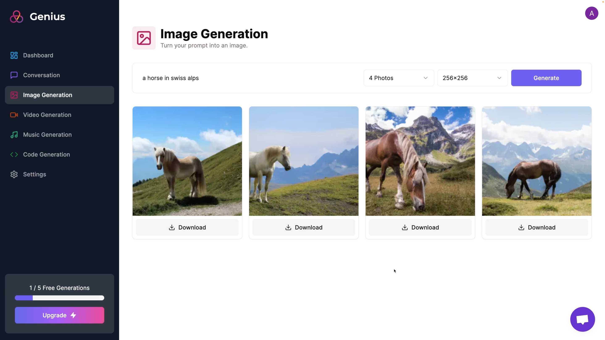

# AI-SAAS Tools for small businesses.

## Main Technologies - Next.js 13, React, Tailwind, Prisma, Stripe 

### Overview

A one-stop service Web app designed as SAAS tools to help small businesses ans software house generate content with code, Image, music, video and communicate with AI.

### Screenshots




Features:

- Tailwind design
- Tailwind animations and effects
- Full responsiveness
- Clerk Authentication (Email, Google, 9+ Social Logins)
- Client form validation and handling using react-hook-form
- Server error handling using react-toast
- Image Generation Tool (Open AI)
- Video Generation Tool (Replicate AI)
- Conversation Generation Tool (Open AI)
- Music Generation Tool (Replicate AI)
- Page loading state
- Stripe monthly subscription
- Free tier with API limiting
- How to write POST, DELETE, and GET routes in route handlers (app/api)
- How to fetch data in server react components by directly accessing database (WITHOUT API! like Magic!)
- How to handle relations between Server and Child components!
- How to reuse layouts
- Folder structure in Next 13 App Router

### Prerequisites

**Node version 18.x.x**

### Cloning the repository

```shell
git clone https://github.com/richiectr360/official-ai-saas
```

### Install packages

```shell
npm i
```

### Setup .env file


```js
NEXT_PUBLIC_CLERK_PUBLISHABLE_KEY=
CLERK_SECRET_KEY=

NEXT_PUBLIC_CLERK_SIGN_IN_URL=/sign-in
NEXT_PUBLIC_CLERK_SIGN_UP_URL=/sign-up
NEXT_PUBLIC_CLERK_AFTER_SIGN_IN_URL=/dashboard
NEXT_PUBLIC_CLERK_AFTER_SIGN_UP_URL=/dashboard

OPENAI_API_KEY=
REPLICATE_API_TOKEN=

DATABASE_URL=

STRIPE_API_KEY=
STRIPE_WEBHOOK_SECRET=

NEXT_PUBLIC_APP_URL="http://localhost:3000"
```

### Setup Prisma

Add MySQL Database (I used PlanetScale)

```shell
npx prisma db push

```

### Start the app

```shell
npm run dev
```

## Available commands

Running commands with npm `npm run [command]`

| command         | description                              |
| :-------------- | :--------------------------------------- |
| `dev`           | Starts a development instance of the app |

